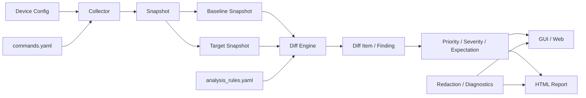

# 프로그램 구조

백본 상태 추적기는 장비 출력 수집, Snapshot 저장, 비교, Finding 분류, 보고서 생성을 분리해 운영 결과의 근거를 추적할 수 있도록 구성합니다.

## 전체 흐름



## 1. 수집 계층

`core/collector.py`가 장비 세션을 열고 `config/commands.yaml`에 정의된 상태 명령을 실행합니다.

명령 목록은 코드에 흩어놓지 않고 설정 파일에서 관리해 다음을 명확하게 확인할 수 있도록 합니다.

- 어떤 명령이 운영 장비에서 실행되는지
- 명령별 목적과 category
- timeout
- 실패 허용 여부
- session setup 명령과 실제 상태 조회 명령의 구분

장비 구성 변경 명령은 기본 명령 세트에 포함하지 않습니다.

## 2. 연결 상태 계층

`core/connectivity.py`는 장비 자체의 접속 가능 여부와 개별 명령 결과를 분리합니다.

장비에 접속할 수 없는 상황에서 Interface, OSPF, LACP, VRRP 등 모든 결과가 각각 사라졌다고 표시하면 동일한 원인이 여러 장애처럼 보일 수 있습니다.

따라서 비교 엔진은 장비 접속 실패를 `device_connectivity` finding 하나로 표현하고, 해당 장비에서 실행하지 못한 하위 명령의 누락 경고를 억제합니다.

이 구조는 **관측할 수 없음**과 **실제로 상태가 비정상임**을 구분하기 위한 것입니다.

## 3. Snapshot 계층

`core/snapshot.py`는 수집 시점의 결과를 Snapshot으로 저장합니다.

Snapshot은 작업 전 기준과 작업 단계/작업 후 결과를 같은 형태로 유지하여 비교 입력을 일정하게 만듭니다.

```text
작업 전 수집 → Baseline Snapshot
작업 중/후 수집 → Target Snapshot
```

비교 결과만 남기지 않고 원본 Snapshot 관계를 유지하므로, 어떤 관측값을 기준으로 finding이 생성되었는지 다시 확인할 수 있습니다.

## 4. 정규화와 비교

`core/diff_engine.py`는 장비명과 command ID를 기준으로 Baseline/Target 결과를 연결합니다.

비교 전에 다음과 같은 변동성 높은 출력을 정규화합니다.

- 현재 시각
- clock
- uptime
- boot time
- 날짜/시간 표현
- 빈 행과 일부 프롬프트성 행

정규화 후에도 의미 있는 변화가 있는 경우 unified diff와 구조화된 changed line 정보를 생성합니다.

반대로 문자열이 같더라도 현재 상태가 CPU/Memory 임계값 같은 health 조건을 위반하면 별도 finding을 생성할 수 있습니다.

## 5. 분석 규칙

`config/analysis_rules.yaml`과 `core/analysis_rules.py`가 운영 의미를 정의합니다.

규칙은 크게 세 부분입니다.

### Threshold

CPU/Memory와 같이 수치 기반으로 판단할 기준입니다.

### Finding

Interface Down, OSPF 상태 이탈, VRRP 변화, LACP 감소 등 특정 변화의:

- 제목
- 영향 이유
- 운영자 확인 방향
- 우선순위

를 정의합니다.

### Expected Change

작업 단계에서 의도적으로 발생할 수 있는 변화를 별도로 표시합니다.

예를 들어 장비 OFF 단계의 접속 실패나 복구 단계의 접속 회복을 stage/device/command/summary 조합으로 식별할 수 있습니다.

Expected Change는 finding을 삭제하지 않습니다. **변화 자체는 기록하되 작업 계획과 일치하는지 판단할 맥락을 추가합니다.**

## 6. Finding 결과

비교 항목은 다음 정보를 함께 가질 수 있습니다.

- 장비
- command ID
- category
- severity
- 변경 요약
- changed line / preview
- finding title
- impact reason
- evidence
- action hint
- expectation
- priority

UI와 보고서는 이 결과를 사용하고 자체적으로 별도의 네트워크 판정 규칙을 만들지 않습니다.

## 7. 보고서

`core/reporter.py`와 관련 모듈은 비교 결과를 사람이 확인하기 쉬운 형태로 변환합니다.

운영자는 우선순위가 높은 긴급/주의 finding을 먼저 확인하고, 필요할 때 변경 원문과 세부 근거를 내려가며 확인할 수 있습니다.

## 8. 진단과 비식별화

`core/diagnostics/`, `core/redaction.py`, `core/report_bundle.py`는 프로그램 자체 문제를 실제 장비 원문 없이 진단할 수 있도록 분리되어 있습니다.

공유 가능한 진단 정보는 가능하면 다음 중심으로 유지합니다.

- 단계
- 성공/실패 여부
- 소요시간
- 건수
- 안정적인 `BST-*` 오류 코드
- 마스킹된 식별정보

실제 운영 장비의 원문 출력, 내부 IP, Hostname, 자격 증명은 공개 진단 자료에 포함하지 않습니다.

## 9. UI와 실행 경로

사용자는 Windows GUI 또는 로컬 웹앱에서 동일한 수집/비교 결과를 확인할 수 있습니다.

UI의 책임은 다음에 한정합니다.

- 설정 입력
- 작업 단계 선택
- 수집 실행
- Snapshot 선택
- 비교 결과 표시
- 보고서 열기

네트워크 상태 판정은 수집/비교/분석 계층에서 수행합니다.
