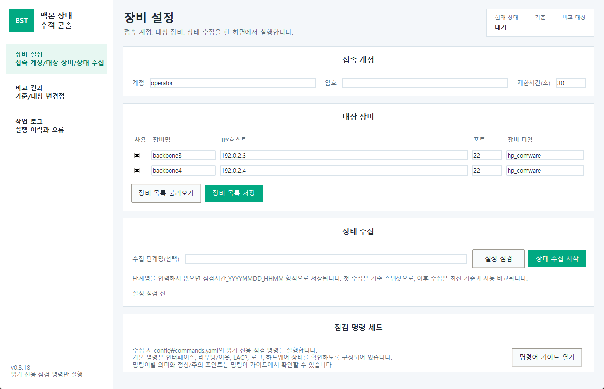
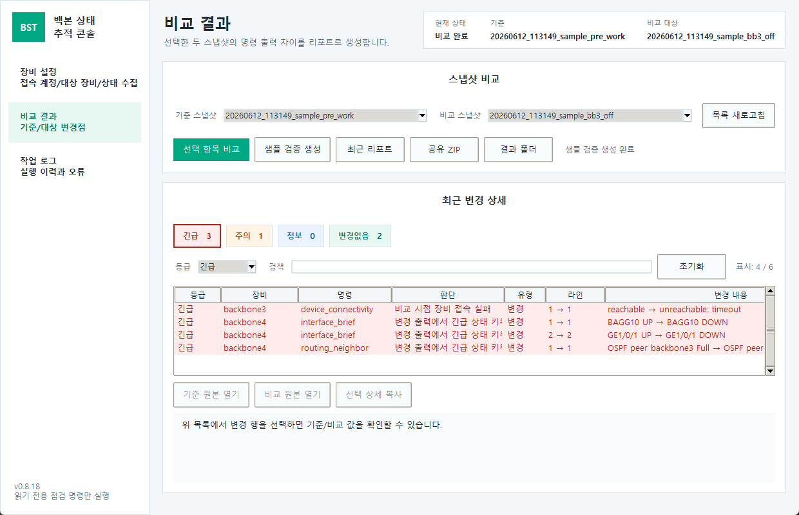
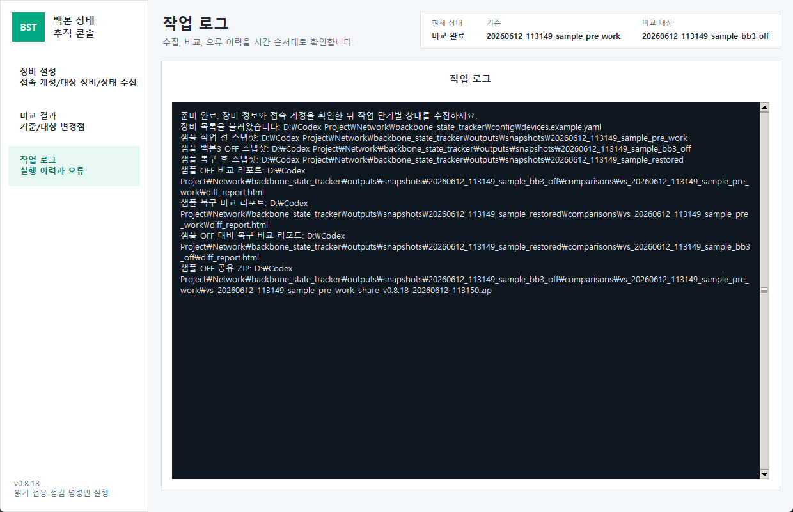

# Backbone State Tracker 사용자 가이드

문서 버전: v0.8.18  
작성일: 2026-06-12  
대상: 백본 3/4호기 상태 점검 및 휴전 작업 검증 담당자

## 1. 핵심 흐름

1. `장비 설정`에서 접속 계정, 백본3/4 대상 장비, 상태 수집을 한 화면에서 처리합니다.
2. 첫 상태 수집은 기준 스냅샷으로 저장됩니다.
3. 이후 상태 수집은 사용자가 입력한 단계명으로 저장하고 최신 기준 스냅샷과 자동 비교합니다.
4. 단계명을 비우면 `점검시간_YYYYMMDD_HHMM` 이름으로 저장됩니다.
5. 수집이 시작되거나 오류가 발생하면 `작업 로그` 화면으로 자동 이동합니다.
6. 비교 결과의 `긴급`, `주의`, `정보`, `변경없음` 카드를 누르면 해당 등급만 볼 수 있습니다.

## 2. 장비 설정과 상태 수집



- 계정에는 SSH 접속 계정을 입력합니다. 암호는 저장하지 않습니다.
- 대상 장비에는 백본3/4호기의 IP, 포트, 장비 타입을 입력합니다.
- `설정 점검`은 장비 목록과 명령 세트 설정을 로컬에서 먼저 검증합니다.
- `상태 수집 시작`은 읽기 전용 점검 명령만 실행합니다.
- `config/commands.yaml`에 정의된 명령만 실행되며, shutdown, save, reboot 같은 변경 명령은 포함하지 않습니다.

## 3. 비교 결과 확인



- 상단의 `긴급`, `주의`, `정보`, `변경없음` 카드는 필터 버튼입니다.
- 목록은 장비, 명령, 판단, 변경 유형, 라인, 변경 내용을 함께 보여줍니다.
- 변경 행을 선택하면 기준 값과 비교 값, 원본 파일 위치, 운영 메모를 확인할 수 있습니다.
- 장비가 접속되지 않으면 여러 명령 누락으로 흩어지지 않고 `device_connectivity` 한 줄로 표시됩니다.

## 4. 작업 로그



- 수집 시작, 설정 오류, 비교 완료, 리포트 생성 위치가 시간 순서로 남습니다.
- 로그에는 명백한 비밀 값이 마스킹됩니다.
- 장비 원본 출력은 증거 보존을 위해 `raw/*.txt`에 별도 저장됩니다. 외부 공유 전 민감 정보 포함 여부를 확인하세요.

## 5. 등급 판단 기준

- `긴급`: 장비 접속 실패, 명령 실패, 인터페이스 Down, LACP selected 수 감소, OSPF Full 이탈, major alarm, fault, abnormal, offline, missing 같은 즉시 확인이 필요한 변화입니다.
- `주의`: minor alarm, warning, error, 라우팅/STP/로그/리소스 변화처럼 영향 확인이 필요한 변화입니다.
- `정보`: 접속 복구 또는 긴급/주의 키워드가 없는 일반 출력 변화입니다.
- `변경없음`: 의미 있는 변경이 감지되지 않은 항목입니다. HTML 리포트에서는 기본으로 접혀 있습니다.

## 6. HTML 리포트

- HTML 리포트 상단의 등급 카드도 필터로 동작합니다.
- `변경없음` 블록은 제목만 보이고 접혀 있으므로 필요한 경우에만 펼칩니다.
- 변경 표는 각 행 안에 등급, 장비, 명령, 분류, 변경 수, 첫 변경, 요약을 함께 보여주도록 구성되어 있습니다.
- 명령별 상세에는 기준 값과 비교 값이 같은 줄에 표시되어 어느 라인이 바뀌었는지 바로 확인할 수 있습니다.

## 7. 샘플 검증

- `비교 결과`의 `샘플 검증 생성`은 실제 장비에 접속하지 않습니다.
- 샘플은 백본3 접속 실패, 백본4 링크 변화, 복구 후 상태 예시를 생성해 UI와 리포트 동작을 검증합니다.

## 8. 배포 ZIP 확인

Windows EXE ZIP 예시:

```powershell
Get-FileHash -Algorithm SHA256 .\backbone_state_tracker_v0.8.18_YYYYMMDD_windows_exe.zip
python .\tools\verify_release_package.py .\dist\backbone_state_tracker_v0.8.18_YYYYMMDD_windows_exe.zip --require-manifest
powershell -ExecutionPolicy Bypass -File .\backbone_state_tracker_v0.8.18_YYYYMMDD_verify_release_package.ps1 -Package .\backbone_state_tracker_v0.8.18_YYYYMMDD_windows_exe.zip -RequireManifest
```

사내 메일이 `.exe`, `.py`, `.ps1` 포함 ZIP을 차단할 수 있습니다. 이 경우 승인된 내부 파일 반입 절차를 사용하세요.
